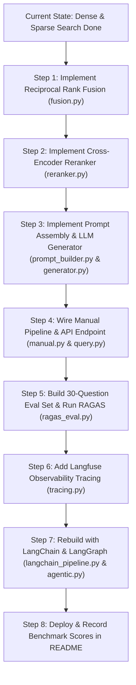

# P2(RAG): Development, Architecture, and Project Status Analysis

**Last Updated:** August 14, 2026  
**Target Project:** `p2(RAG)` — Production-Grade RAG Service with Real Evaluation  
**Location:** `c:\Users\piyxs\Desktop\projects\p2(RAG)`  
**Current Progress:** **~25% – 30% Complete**  

---

## 1. Executive Summary

This document provides a comprehensive audit of the **development, architecture, and current implementation status** of **Project 2: Production-Grade RAG Service (`p2(RAG)`)**. 

It compares the current codebase state against:
1. **Master Portfolio Intent & Specification:** [`project_portfolio_full_spec (1).md`](file:///c:/Users/piyxs/Desktop/projects/project_portfolio_full_spec%20%281%29.md)
2. **Internal Agent Specifications & PRD:** Files inside [`agentsfile/`](file:///c:/Users/piyxs/Desktop/projects/p2%28RAG%29/agentsfile) (`PRD.md`, `ARCHITECTURE.md`, `IMPLEMENTATION_PLAN.md`, `AGENTS.md`)

### Key Takeaway
The **architectural foundation, setup, ingestion pipeline, data models, async embedding engine, vector store abstraction, dense search, and sparse BM25 search are 100% complete and functionally verified**. The remaining work consists of Reciprocal Rank Fusion (RRF), Cross-Encoder Reranking, Prompt Assembly + LLM Generation, RAGAS Evaluation, Observability, and the LangChain/LangGraph framework rebuild.

---

## 2. Strategic Intent & Core Architecture

### 2.1 Why This Project Exists
As stated in `project_portfolio_full_spec (1).md`:
* **Resume Gap:** While client work proves fast product feature shipping, it does not publicly demonstrate RAG pipeline internals, mathematical evaluation methodology, async Python/FastAPI backend depth, or MLOps observability.
* **Advera Public Replacement:** This project serves as the flagship public evidence for AI engineering capabilities.
* **The Standing Reflex:** Designed to instill a core engineering habit:
  1. *What does the component promise?*
  2. *What mechanism keeps that promise?*
  3. *Where does the mechanism break?*
  4. *What do you do about the break?*

### 2.2 Core Architectural Principles
* **Manual-First Philosophy:** Core retrieval logic (chunking, embedding, vector search, BM25 keyword search, reciprocal rank fusion, cross-encoder reranking, prompt building) is written by hand **before** using frameworks like LangChain or LangGraph.
* **Hybrid Retrieval Strategy:** Combines dense semantic vector search with sparse keyword search (BM25) fused via Reciprocal Rank Fusion (RRF), followed by a cross-encoder reranker to optimize top-k precision.
* **Swappable VectorStore Backend:** Features an `InMemoryVectorStore` (loading from snapshot `data/mock_index.json`) for zero-dependency local development and a production-ready `PgVectorStore` for PostgreSQL (`pgvector`).
* **Async & Fault-Tolerant Engine:** Uses FastAPI async handlers, `asyncio.gather` with `asyncio.Semaphore(10)` backpressure control, and `tenacity` exponential backoff retries for API rate limits.

---

## 3. Comparative Alignment Matrix

| Portfolio Requirement (`project_portfolio_full_spec (1).md`) | `agentsfile` Target Specs | Actual Codebase State | Status |
| :--- | :--- | :--- | :--- |
| **FastAPI Async Backend** | Python 3.11, FastAPI, Pydantic, Poetry | [`src/main.py`](file:///c:/Users/piyxs/Desktop/projects/p2%28RAG%29/src/main.py), [`src/config.py`](file:///c:/Users/piyxs/Desktop/projects/p2%28RAG%29/src/config.py), [`pyproject.toml`](file:///c:/Users/piyxs/Desktop/projects/p2%28RAG%29/pyproject.toml) | ✅ **DONE** (Phase 0) |
| **Document Ingestion & Chunking** | Load `.md`/`.txt`/`.pdf`, chunk 500 chars with 50 char overlap | [`loaders.py`](file:///c:/Users/piyxs/Desktop/projects/p2%28RAG%29/src/ingestion/loaders.py), [`chunker.py`](file:///c:/Users/piyxs/Desktop/projects/p2%28RAG%29/src/ingestion/chunker.py), [`pipeline.py`](file:///c:/Users/piyxs/Desktop/projects/p2%28RAG%29/src/ingestion/pipeline.py) | ✅ **DONE** (Phase 1) |
| **Async Embeddings Engine** | Batched async API calls + semaphore + exponential backoff | [`embedder.py`](file:///c:/Users/piyxs/Desktop/projects/p2%28RAG%29/src/ingestion/embedder.py) (Cohere `embed-english-v3.0`, 1024 dims) | ✅ **DONE** (Phase 1) |
| **Database Schema** | `Document` and `Chunk` ORM tables (pgvector) | [`models.py`](file:///c:/Users/piyxs/Desktop/projects/p2%28RAG%29/src/db/models.py), [`session.py`](file:///c:/Users/piyxs/Desktop/projects/p2%28RAG%29/src/db/session.py) | ✅ **DONE** (Phase 1) |
| **Dense Vector Search** | Cosine similarity query against stored embeddings | [`dense.py`](file:///c:/Users/piyxs/Desktop/projects/p2%28RAG%29/src/retrieval/dense.py), [`stores.py`](file:///c:/Users/piyxs/Desktop/projects/p2%28RAG%29/src/retrieval/stores.py) | ✅ **DONE** (Phase 2) |
| **Sparse Keyword Search** | BM25 keyword matching over tokenized corpus | [`sparse.py`](file:///c:/Users/piyxs/Desktop/projects/p2%28RAG%29/src/retrieval/sparse.py) (`rank_bm25`) | ✅ **DONE** (Phase 2) |
| **Reciprocal Rank Fusion (RRF)** | Formula: $\text{score}(d) = \sum \frac{1}{k + \text{rank}(d)}$ ($k=60$) | [`fusion.py`](file:///c:/Users/piyxs/Desktop/projects/p2%28RAG%29/src/retrieval/fusion.py) (Stub only) | ❌ **NOT DONE** (0%) |
| **Cross-Encoder Reranking** | Rerank top results using `ms-marco-MiniLM-L-6-v2` | [`reranker.py`](file:///c:/Users/piyxs/Desktop/projects/p2%28RAG%29/src/retrieval/reranker.py) (Stub only) | ❌ **NOT DONE** (0%) |
| **Prompt Assembly & LLM Call** | Grounded prompt + source citations + Groq API | [`prompt_builder.py`](file:///c:/Users/piyxs/Desktop/projects/p2%28RAG%29/src/generation/prompt_builder.py), [`generator.py`](file:///c:/Users/piyxs/Desktop/projects/p2%28RAG%29/src/generation/generator.py) (Stubs) | ❌ **NOT DONE** (0%) |
| **Manual Pipeline & API Route** | Async FastAPI `POST /query` endpoint wiring manual pipeline | [`manual.py`](file:///c:/Users/piyxs/Desktop/projects/p2%28RAG%29/src/pipeline/manual.py), [`query.py`](file:///c:/Users/piyxs/Desktop/projects/p2%28RAG%29/src/api/routes/query.py) (Stubs) | ❌ **NOT DONE** (0%) |
| **RAGAS Evaluation Suite** | 30+ test questions, Faithfulness, Relevance, Precision/Recall | [`test_set.json`](file:///c:/Users/piyxs/Desktop/projects/p2%28RAG%29/evaluation/test_set.json) (`[]`), [`ragas_eval.py`](file:///c:/Users/piyxs/Desktop/projects/p2%28RAG%29/src/evaluation/ragas_eval.py) (Stub) | ❌ **NOT DONE** (0%) |
| **Observability & Tracing** | Langfuse/LangSmith token usage, latency, cost tracing | [`tracing.py`](file:///c:/Users/piyxs/Desktop/projects/p2%28RAG%29/src/observability/tracing.py) (Stub) | ❌ **NOT DONE** (0%) |
| **Framework Rebuild** | Rebuild with LangChain & LangGraph agentic logic | [`langchain_pipeline.py`](file:///c:/Users/piyxs/Desktop/projects/p2%28RAG%29/src/pipeline/langchain_pipeline.py), [`agentic.py`](file:///c:/Users/piyxs/Desktop/projects/p2%28RAG%29/src/pipeline/agentic.py) (Stubs) | ❌ **NOT DONE** (0%) |
| **Deployment & Benchmarks** | Deployed container + README before/after RAGAS numbers | [`README.md`](file:///c:/Users/piyxs/Desktop/projects/p2%28RAG%29/README.md) (Template tables pending execution) | ❌ **NOT DONE** (0%) |

---

## 4. Detailed Audit of Completed Work

### 4.1 Phase 0: Scaffolding & Setup (100% Complete)
* [`pyproject.toml`](file:///c:/Users/piyxs/Desktop/projects/p2%28RAG%29/pyproject.toml): Configured with FastAPI, Uvicorn, SQLAlchemy async, asyncpg, pgvector, rank-bm25, ragas, langchain, langgraph, httpx, pytest, pytest-asyncio.
* [`Dockerfile`](file:///c:/Users/piyxs/Desktop/projects/p2%28RAG%29/Dockerfile) & [`docker-compose.yml`](file:///c:/Users/piyxs/Desktop/projects/p2%28RAG%29/docker-compose.yml): Set up with PostgreSQL 16 using `pgvector/pgvector:pg16`.
* [`src/main.py`](file:///c:/Users/piyxs/Desktop/projects/p2%28RAG%29/src/main.py) & [`src/config.py`](file:///c:/Users/piyxs/Desktop/projects/p2%28RAG%29/src/config.py): App initialization with health check route (`/health`) and Pydantic environment configuration loading `.env.local`.

### 4.2 Phase 1: Ingestion Pipeline (100% Complete)
* [`src/ingestion/loaders.py`](file:///c:/Users/piyxs/Desktop/projects/p2%28RAG%29/src/ingestion/loaders.py): Ingests text from `.md`, `.txt`, and text-native `.pdf` files.
* [`src/ingestion/chunker.py`](file:///c:/Users/piyxs/Desktop/projects/p2%28RAG%29/src/ingestion/chunker.py): Implements fixed-size character chunking (500 chars) with 50-character sliding overlap to prevent concept severing at boundaries.
* [`src/ingestion/embedder.py`](file:///c:/Users/piyxs/Desktop/projects/p2%28RAG%29/src/ingestion/embedder.py): Utilizes Cohere API (`embed-english-v3.0`, 1024 dims). Features async batching (96 items/batch), max 10 concurrent requests via `asyncio.Semaphore(10)`, and exponential backoff retry via `tenacity`.
* [`src/db/models.py`](file:///c:/Users/piyxs/Desktop/projects/p2%28RAG%29/src/db/models.py): Defines `Document` and `Chunk` tables in SQLAlchemy with `Vector(1024)` type mapping.
* [`src/ingestion/pipeline.py`](file:///c:/Users/piyxs/Desktop/projects/p2%28RAG%29/src/ingestion/pipeline.py): Full ingestion orchestrator using `asyncio.to_thread` for file I/O, deduplicating documents via `source_url`, with per-document database commits for fault tolerance.

### 4.3 Phase 2: Initial Retrieval Architecture (50% Complete)
* [`src/retrieval/stores.py`](file:///c:/Users/piyxs/Desktop/projects/p2%28RAG%29/src/retrieval/stores.py): Implements clean `VectorStore` interface with:
  1. `InMemoryVectorStore`: Cosine similarity over snapshot [`data/mock_index.json`](file:///c:/Users/piyxs/Desktop/projects/p2%28RAG%29/data/mock_index.json) (29 pre-embedded chunks from standard corpus). Allows running without Docker/Postgres.
  2. `PgVectorStore`: Native SQL cosine distance (`<=>`) queries for pgvector.
* [`src/retrieval/dense.py`](file:///c:/Users/piyxs/Desktop/projects/p2%28RAG%29/src/retrieval/dense.py): Async dense vector search function querying query embeddings against stored vectors.
* [`src/retrieval/sparse.py`](file:///c:/Users/piyxs/Desktop/projects/p2%28RAG%29/src/retrieval/sparse.py): In-memory BM25 Okapi search implemented over tokenized chunk texts using `rank_bm25`.

---

## 5. Detailed Audit of Remaining Work

### 5.1 Complete Phase 2: Manual Pipeline & LLM Generation
1. **Reciprocal Rank Fusion ([`src/retrieval/fusion.py`](file:///c:/Users/piyxs/Desktop/projects/p2%28RAG%29/src/retrieval/fusion.py)):**
   * Implement `async fuse(dense_results, sparse_results, k=60) -> list[tuple[Chunk, float]]`.
   * Apply formula $\text{score}(d) = \sum \frac{1}{k + \text{rank}(d)}$.
   * Merge same-chunk IDs across both dense and sparse lists while retaining items appearing in only one list.
2. **Cross-Encoder Reranker ([`src/retrieval/reranker.py`](file:///c:/Users/piyxs/Desktop/projects/p2%28RAG%29/src/retrieval/reranker.py)):**
   * Load `sentence-transformers` model `cross-encoder/ms-marco-MiniLM-L-6-v2`.
   * Score `(query, chunk_text)` pairs for the top-N fused candidates.
3. **Prompt Assembly ([`src/generation/prompt_builder.py`](file:///c:/Users/piyxs/Desktop/projects/p2%28RAG%29/src/generation/prompt_builder.py)):**
   * Construct strict system prompts embedding context chunks with source metadata (`document_title`, `chunk_id`).
4. **LLM Generation ([`src/generation/generator.py`](file:///c:/Users/piyxs/Desktop/projects/p2%28RAG%29/src/generation/generator.py)):**
   * Connect Groq API (or alternative free LLM endpoint) for response generation.
5. **End-to-End Wiring ([`src/pipeline/manual.py`](file:///c:/Users/piyxs/Desktop/projects/p2%28RAG%29/src/pipeline/manual.py) & [`src/api/routes/query.py`](file:///c:/Users/piyxs/Desktop/projects/p2%28RAG%29/src/api/routes/query.py)):**
   * Connect `Dense + Sparse -> RRF -> Reranker -> Prompt -> LLM` into FastAPI route `POST /query`.

### 5.2 Phase 3: Evaluation Suite (Highest Signal Deliverable)
1. **Evaluation Dataset ([`evaluation/test_set.json`](file:///c:/Users/piyxs/Desktop/projects/p2%28RAG%29/evaluation/test_set.json)):**
   * Create minimum **30 hand-crafted test questions** with expected ground-truth answers and target chunk IDs.
2. **RAGAS Evaluation Harness ([`src/evaluation/ragas_eval.py`](file:///c:/Users/piyxs/Desktop/projects/p2%28RAG%29/src/evaluation/ragas_eval.py) & [`scripts/run_eval.py`](file:///c:/Users/piyxs/Desktop/projects/p2%28RAG%29/scripts/run_eval.py)):**
   * Run eval script calculating **Faithfulness**, **Answer Relevance**, **Context Precision**, and **Context Recall**.
   * Compare Naive Vector Search scores vs. Hybrid + Reranked pipeline scores.
3. **Failure Analysis Documentation:**
   * Document at least 1 concrete failure mode with root cause analysis in [`README.md`](file:///c:/Users/piyxs/Desktop/projects/p2%28RAG%29/README.md).

### 5.3 Phase 4: Observability
1. **Tracing Setup ([`src/observability/tracing.py`](file:///c:/Users/piyxs/Desktop/projects/p2%28RAG%29/src/observability/tracing.py)):**
   * Instrument pipeline stages using Langfuse or LangSmith.
   * Log stage latency, token counts, and cost metrics.

### 5.4 Phase 5: Framework Rebuild
1. **LangChain Rebuild ([`src/pipeline/langchain_pipeline.py`](file:///c:/Users/piyxs/Desktop/projects/p2%28RAG%29/src/pipeline/langchain_pipeline.py)):** Replicate Phase 2 using LangChain abstractions.
2. **LangGraph Agent ([`src/pipeline/agentic.py`](file:///c:/Users/piyxs/Desktop/projects/p2%28RAG%29/src/pipeline/agentic.py)):** Implement decision logic to trigger re-retrieval on low-confidence scoring.

### 5.5 Phase 6: Deployment & Benchmark Reporting
1. **Deployment:** Host service container on cloud infrastructure.
2. **README Benchmark Population:** Update [`README.md`](file:///c:/Users/piyxs/Desktop/projects/p2%28RAG%29/README.md) with empirical RAGAS score tables and latency/cost benchmarks.

---

## 6. Immediate Next Steps Roadmap

---

## 7. Definition of "Done" Checklist

A phase or feature is only considered **done** when you can answer cold without notes:
- [ ] **RRF:** *What does Reciprocal Rank Fusion promise? Why $k=60$? What happens at $k=0$?*
- [ ] **Reranker:** *What is the difference between a bi-encoder and a cross-encoder? Why can't a cross-encoder be used over the full corpus?*
- [ ] **Evaluation:** *What does RAGAS Faithfulness actually compute? What was the exact score diff between naive and hybrid?*
- [ ] **Framework Diff:** *What did LangChain abstract away? What control was gained/lost?*
